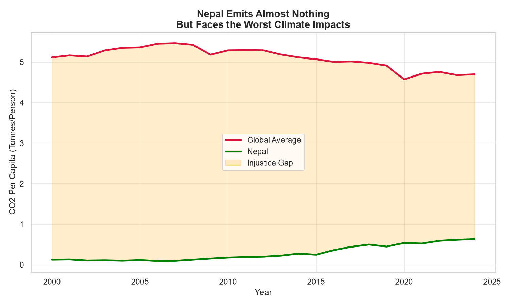
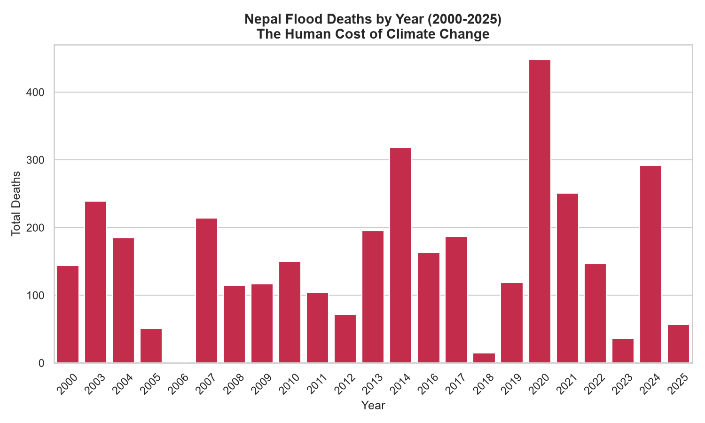
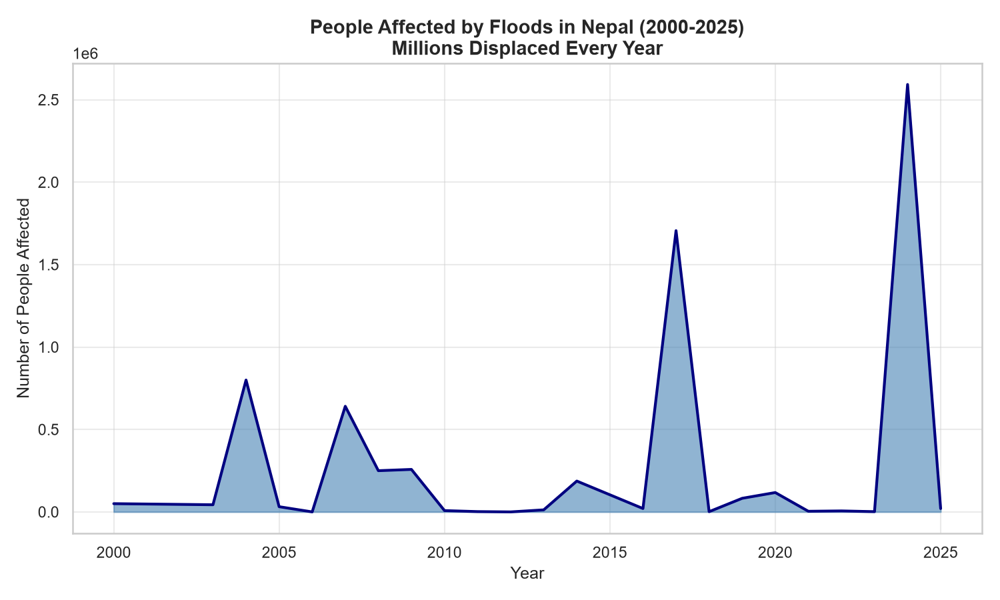
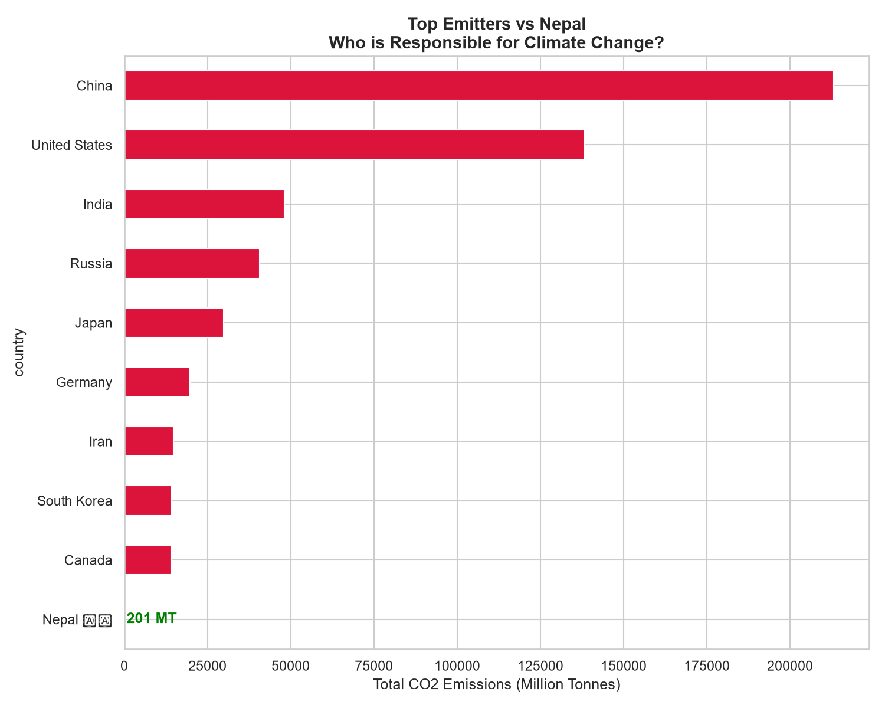
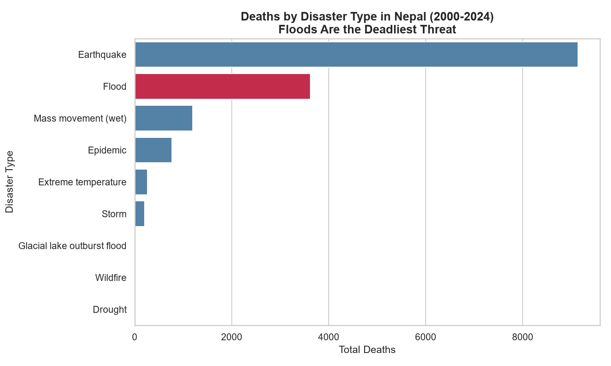

# 🌏 Climate Justice: Nepal's Flood Crisis vs Its Tiny Carbon Footprint

Analyzing how Nepal — one of the world's lowest CO2 emitters — 
bears the devastating human cost of climate change it didn't cause.

---

## 📌 Project Overview

This project combines global CO2 emissions data with Nepal's 
natural disaster records to expose a critical climate injustice: 
Nepal emits 8x less CO2 than the global average per person, 
yet suffers catastrophic floods, landslides and displacement 
every single year.

**Data Sources:**
- Our World in Data — Global CO2 Emissions Dataset
- EM-DAT — Nepal Natural Disaster Records (2000–2025)

---

## ❓ Questions Answered

| # | Question |
|---|---|
| 1 | How does Nepal's CO2 compare to the global average? |
| 2 | How many people die from floods in Nepal each year? |
| 3 | How many people are displaced by floods annually? |
| 4 | Which countries are responsible for Nepal's climate crisis? |
| 5 | What types of disasters kill the most people in Nepal? |

---

## 📊 Key Findings

- 🇳🇵 **Nepal emits only 0.6 tonnes CO2 per person** vs global average of 5 tonnes
- 🌊 **2024 was the worst year** — 2.6 million people affected by floods
- ☠️ **3,600+ Nepalis killed by floods** since 2000
- 🏭 **China emits 1,000x more than Nepal** — yet Nepal suffers the consequences
- 📈 **Flood intensity is increasing** — recent years show record displacement
- ⛰️ **Floods + Landslides combined** rival earthquake deaths in Nepal

---

## 📈 Visualizations

### Nepal CO2 vs Global Average — The Injustice Gap

### Nepal Flood Deaths by Year

### People Affected by Floods

### Top Emitters vs Nepal

### Deaths by Disaster Type

---

## 🛠️ Tech Stack

---

## 📁 Project Structure

| File/Folder | Description |
|---|---|
| `data/co2_data.csv` | Global CO2 emissions dataset |
| `data/nepal_disasters.xlsx` | Nepal natural disaster records |
| `analysis.ipynb` | Complete analysis notebook |
| `visuals/` | All generated charts |

---

## 📂 Data Sources

- **Our World in Data** — [CO2 Dataset](https://github.com/owid/co2-data)
- **EM-DAT** — [Nepal Disaster Records](https://public.emdat.be)

---

## 👤 Author

**Baibhav Ojha**
Data Science Student @ Tribhuwan University, Nepal 🇳🇵
[GitHub](https://github.com/baibhavojha2008-tech)

---

## 🔜 Next Project

**SQL-based Data Analysis Project**
